

## WanAndroid 客户端

#### 介绍
>此项目是基于Google推出的能够快速在IOS和Android上构建高质量的原生用户界面的移动UI框架 `Flutter` 构建的原生项目，所使用的语言是Dart语言，项目中的API均来自于[WanAndroid网站](http://www.wanandroid.com)，纯属共享学习之用，不得用于商业用途！！大家有任何疑问或者建议的可以联系[1606561454@qq.com](https://github.com/firefecker/WanAndroid/issues) 。

### 项目功能模块
>项目总共分为`首页`、`体系`、`热词`、`我的`等四大模块。

- `首页`分为了主要的文章列表和banner，当用户点击文章列表和banner时会进入到文章详情页面；
- `体系`区分了文章的类型列表，主要为一级分类目录和二级分类目录，当用户点击分类列表时会跳转到另一个界面，该界面展示效果和Tablayout和Viewpager组合的相关类似，每个都展示的通过二级目录筛选的文章列表，点击文章列表会跳转到文章详情；
- `热词`分为了常搜的热词和常用的网站两类，常搜热词的列表item点击会进入到常搜热词文章列表界面，点击文章会进入到文章详情，常用网站的列表item点击会直接进入文章详情界面；
- `我的`主要罗列了注册、登录、我的收藏和关于功能，当用户注册或者登录获取到用户数据的时候会通过sharePreferences存储数据，点击我的收藏会展示用户收藏文章列表，点击文章列表会进入文章详情；当用户没有登录时点击我的收藏会提示用户注册或登录。

#### 相关界面如下：

- IOS

 <table align="center">
       <tr>
           <td></td>
           <td>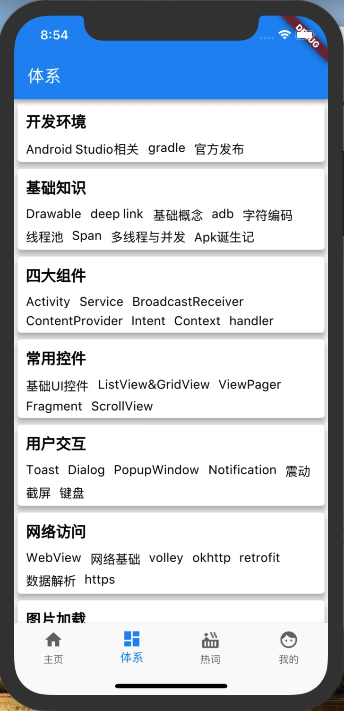</td>
           <td>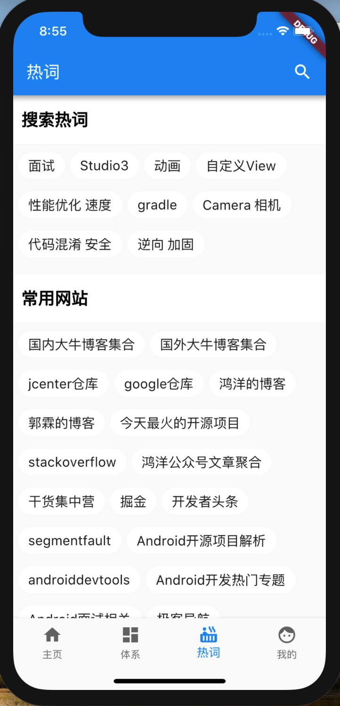</td>
       </tr>
 </table>

 <table align="center">
        <tr>
            <td>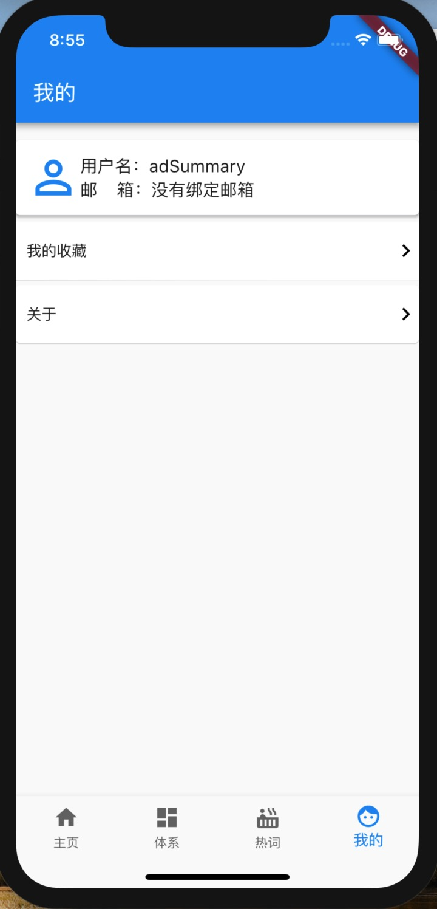</td>
            <td>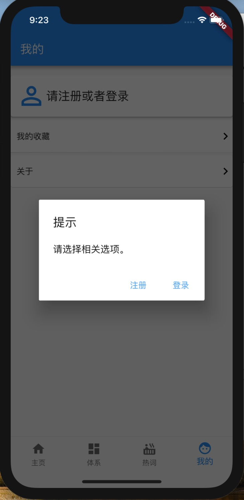</td>
            <td>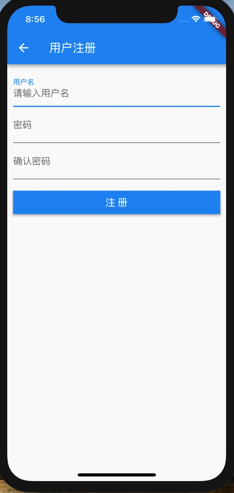</td>
        </tr>
  </table>

  <table align="center">
          <tr>
              <td></td>
              <td>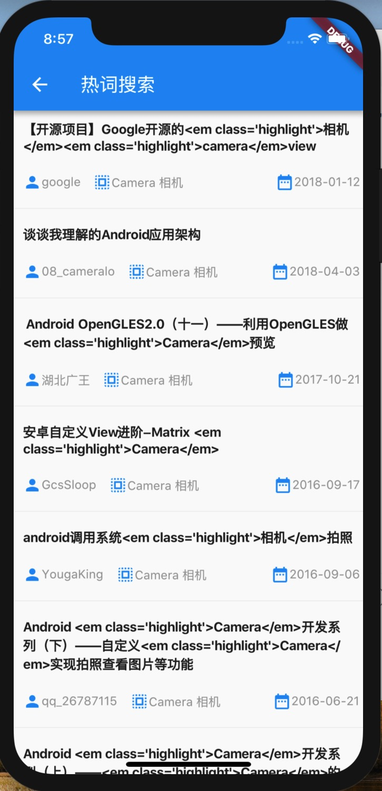</td>
              <td>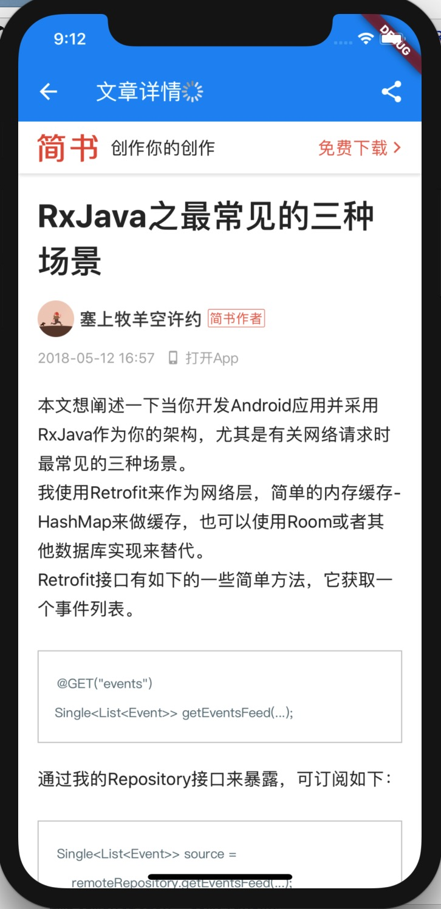</td>
          </tr>
    </table>

- Android

 <table align="center">
       <tr>
           <td>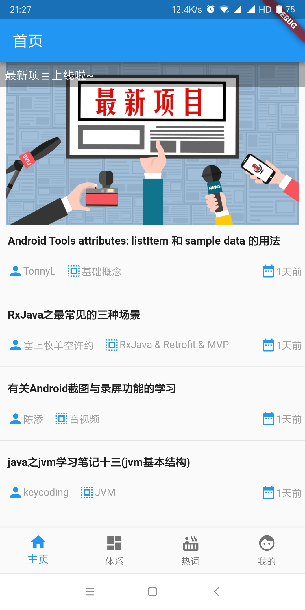</td>
           <td></td>
           <td>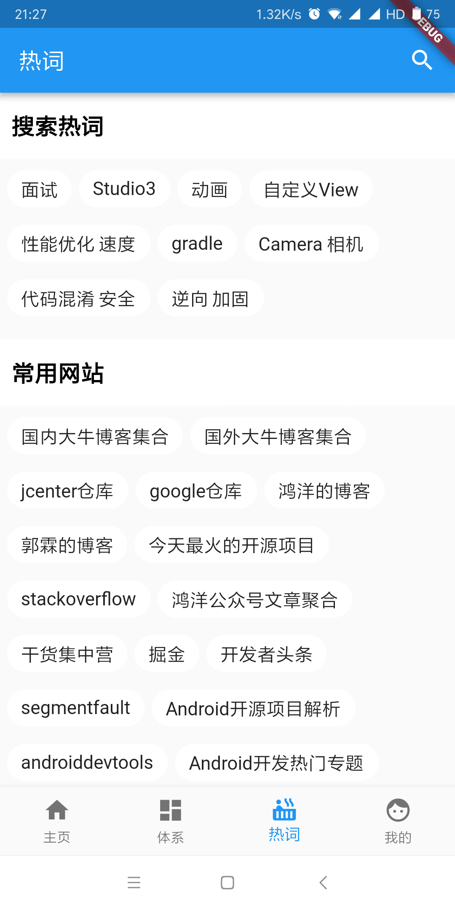</td>
       </tr>
 </table>

 <table align="center">
        <tr>
            <td>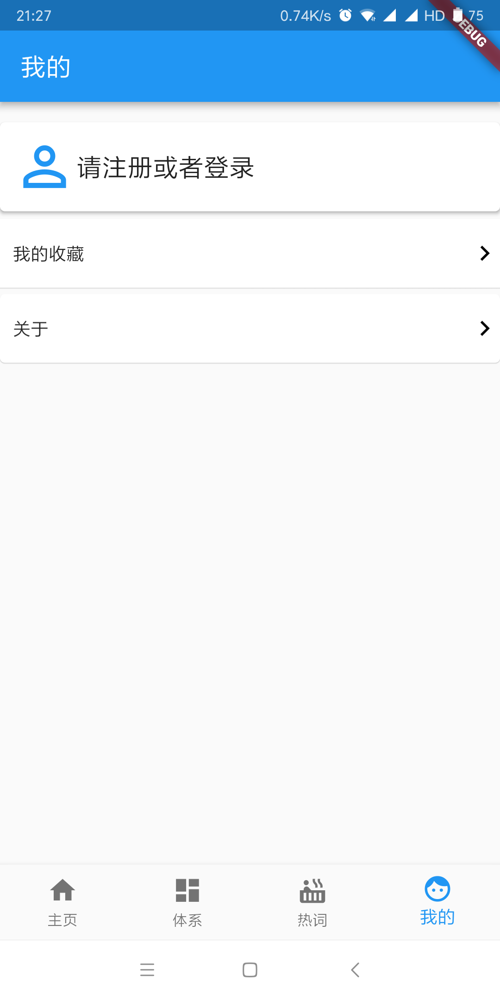</td>
            <td>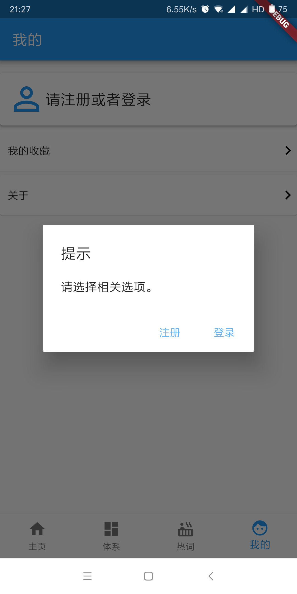</td>
            <td>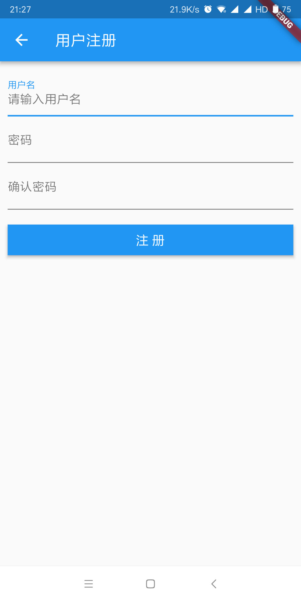</td>
        </tr>
  </table>

  <table align="center">
          <tr>
              <td>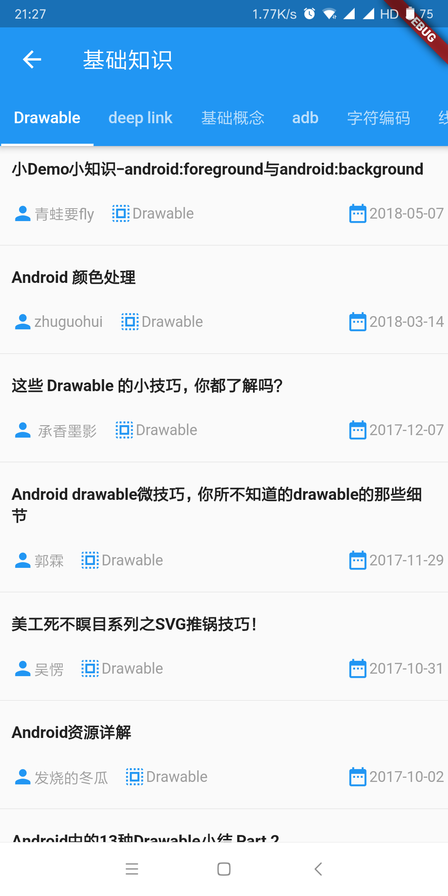</td>
              <td>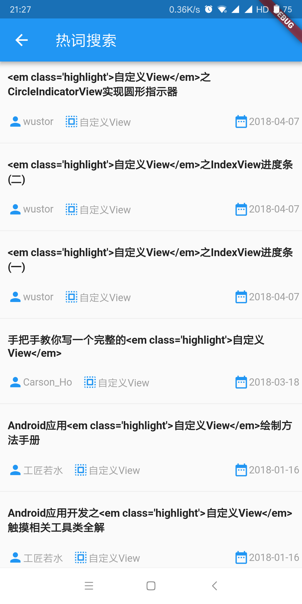</td>
              <td></td>
          </tr>
    </table>

>[项目地址:https://github.com/firefecker/WanAndroid](https://github.com/firefecker/WanAndroid)